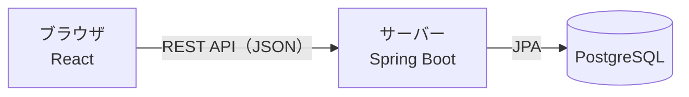

# taskmanagement

Trello 風のタスク管理アプリです。「未着手」「作業中」「完了」の 3 つのリストでカードを管理し、期限が来たらブラウザ通知でお知らせします。

スクールの課題として、要件定義 → 設計 → 実装 → テストというシステム開発の流れを一通り経験するために作っています。完成後は、自分の仕事や勉強のタスク管理に実際に使います。

## 目次

- [アプリの概要](#アプリの概要)
- [技術スタック](#技術スタック)
- [ドキュメント](#ドキュメント)
- [リポジトリの構成](#リポジトリの構成)
- [開発環境の準備](#開発環境の準備)
- [起動と停止](#起動と停止)
- [API](#api)
- [テスト・コードチェック](#テストコードチェック)
- [開発の進め方](#開発の進め方)
- [実装状況](#実装状況)

## アプリの概要

### 前提

| 項目 | 内容 |
| --- | --- |
| 利用者 | 自分ひとり（ログイン・共有機能は不要） |
| 用途 | 仕事のタスクや勉強の進み具合の管理 |
| 動作環境 | パソコン版 Chrome。自分のパソコンの中だけで動かす |

### リストとカード

リストは「未着手」「作業中」「完了」の 3 つで固定です。カードには次の項目があります。

| 項目 | 内容 |
| --- | --- |
| タイトル | 必須（1〜50 文字） |
| 説明文 | 任意（500 文字まで） |
| 期限 | 日付と時刻 |
| 時間厳守 | 遅れてはいけないタスクに付ける。優先度が 1 段階上がる |
| 優先度 | 高・中・低の 3 段階。期限の近さと時間厳守から自動で決まる |

### 主な機能

| No. | 機能 | 内容 |
| --- | --- | --- |
| F-01 | ボード表示 | 3 つのリストを横に並べて表示する |
| F-02 | カード追加 | 各リストにカードを追加する |
| F-03 | カード編集 | タイトル・説明文・期限・時間厳守を変更する |
| F-04 | カード削除 | 確認を表示してからカードを削除する（編集ウィンドウの「削除」か、ボードのゴミ箱マークから） |
| F-05 | リスト間の移動 | ドラッグ＆ドロップでカードを別のリストへ移す |
| F-06 | リスト内の並び替え | ドラッグ＆ドロップで同じリスト内の順番を入れ替える |
| F-07 | データ保存 | 変更のたびに PostgreSQL へ自動で保存する。ブラウザを閉じても残る |
| F-08 | リマインド通知 | 期限の時刻にブラウザ通知を表示する（アプリのタブを開いている間だけ） |
| F-09 | 期限切れの表示 | 期限を過ぎた未完了のカードを赤色で目立たせる |
| F-10 | 優先度の自動判定 | 期限の近さと時間厳守から優先度を自動で決める |
| F-11 | チェックでの移動 | チェックを付けると、未着手 → 作業中 → 完了へ移す |

各機能のルールは [機能要件](docs/requirements/functional.md) を参照してください。

### 今回は作らないもの

- 優先度・期限での自動並べ替え
- ログイン・他の人との共有、担当者の割り当て
- 複数ボード、リストの追加・名前変更
- ブラウザを閉じている間の通知

## 技術スタック



| 区分 | 技術 |
| --- | --- |
| バックエンド | Java 21（OpenJDK 21.0.12）、Spring Boot 4.1.1、Spring Data JPA 4.1.1（Hibernate 7.4.5）、Flyway 12.4.0 |
| バックエンドのビルド | Maven 3.9.16（Maven Wrapper 3.3.4 の `./mvnw` で動かす。Gradle は使わない） |
| フロントエンド | TypeScript 7.0.2、React 19.3.0、Vite 8.3.4、dnd-kit（@dnd-kit/core 6.3.1・@dnd-kit/sortable 10.0.0） |
| フロントエンドのパッケージ管理 | npm 11.19.0（Node.js 24.21.0） |
| データベース | PostgreSQL 17.11（Docker イメージ `postgres:17`、Docker Compose で起動） |
| テスト | JUnit 6、Testcontainers 2.0（バックエンド）／Vitest 5.0、React Testing Library 16.3（フロントエンド） |
| コードチェック | oxlint 1.87、Prettier 3.9 |
| 開発環境 | Colima 0.10.3、Docker 29.8.2、Docker Compose 5.6.0、Git 2.39.5、GitHub CLI 2.101.0 |

Next.js は使わず、React は Vite で作るブラウザだけで動く画面（SPA）にしています。ライブラリごとの詳しいバージョンは [技術スタック](docs/design/tech-stack.md) を参照してください。

## ドキュメント

入口は [要件定義書](docs/requirements.md) です。

| 種類 | ドキュメント | 内容 |
| --- | --- | --- |
| 要件 | [要件定義書](docs/requirements.md) | 背景・目的・スコープ・受け入れ基準・決定事項・未決事項 |
| | [機能一覧](docs/requirements/features.md) | 機能 F-01〜F-11 と、設計・テストとの対応表 |
| | [機能要件](docs/requirements/functional.md) | 各機能が満たすべきルール（入力の文字数、優先度の決め方など） |
| | [画面要件](docs/requirements/screens.md) | 画面 SC-01〜SC-05 で表示する情報とできる操作 |
| | [非機能要件](docs/requirements/non-functional.md) | 対応ブラウザ、応答時間、データの保存先など |
| 設計 | [画面設計](docs/design/screen-design.md) | 画面遷移図と画面レイアウト |
| | [データベース設計](docs/design/database.md) | ER 図とテーブル定義 |
| | [データフロー](docs/design/data-flow.md) | データの流れ、API 一覧、通知・期限切れの判定条件 |
| | [技術スタック](docs/design/tech-stack.md) | 使う技術とバージョン、開発環境、ファイル構成 |
| テスト | [テスト仕様書](docs/test-spec.md) | 機能と非機能要件を確認する手順 |
| 開発ルール | [CLAUDE.md](CLAUDE.md) | イシュー・ブランチ・PR の進め方、開発サーバーのポート |

## リポジトリの構成

```text
taskmanagement/
├── backend/             … Spring Boot（API・データベースの読み書き）
├── frontend/            … React + TypeScript + Vite（画面）
├── docs/                … 要件定義・設計・テストのドキュメント
├── scripts/             … 開発サーバーの起動・停止スクリプト
├── docker-compose.yml   … PostgreSQL の起動設定
├── index.html ほか       … HTML + CSS + JavaScript のプロトタイプ
├── .claude/             … Claude Code のフック・スキル
└── .github/             … イシュー・PR のテンプレート
```

詳しくは [技術スタックの「ファイル構成」](docs/design/tech-stack.md#3-ファイル構成) を参照してください。

## 開発環境の準備

初回だけ行います。

### 必要なもの

| ツール | 用途 |
| --- | --- |
| Java 21 | バックエンドのビルド・起動（Maven 3.9.16 は `backend/mvnw` が自動で用意する） |
| Node.js 24・npm 11 | フロントエンドの依存関係の追加・ビルド・起動 |
| Colima・Docker・Docker Compose | PostgreSQL の起動、バックエンドのテスト |
| GitHub CLI（`gh`） | イシュー・PR の作成 |

### Docker（Colima）

Docker は Colima（Docker Desktop を使わずにコマンドだけで動かせる Docker）を使います。

```sh
brew install colima docker docker-compose
```

`~/.docker/config.json` に次を追加し、`docker compose` を使えるようにします。

```json
"cliPluginsExtraDirs": ["/opt/homebrew/lib/docker/cli-plugins"]
```

### フロントエンドの依存関係

```sh
cd frontend
npm install               # 初回と、package.json が変わったときだけ
```

## 起動と停止

### まとめて起動する（おすすめ）

次の 1 コマンドで、DB・バックエンド・フロントエンドをまとめて起動できます。起動したら http://localhost:5173 を開きます。

```sh
scripts/dev-start.sh      # すべて起動（backend / frontend を付けるとそれだけ）
scripts/dev-stop.sh       # バックエンドとフロントエンドを止める
```

| 対象 | URL・ポート |
| --- | --- |
| フロントエンド | http://localhost:5173 |
| バックエンド | http://localhost:8080 |
| PostgreSQL | `localhost:5432` |

- ポートがほかのプロセスに使われているときは、そのプロセスを止めてから決められたポートで起動します。フロントエンドは `/api` を 8080 に転送しているため、別のポートでは動かしません
- ログは `.dev/backend.log`・`.dev/frontend.log` に出ます
- テーブルはバックエンドの起動時に Flyway が `backend/src/main/resources/db/migration/` の SQL から自動で作ります

### 手動で起動する

```sh
colima start              # Docker を起動（Mac を再起動したら毎回必要）
docker compose up -d      # PostgreSQL を起動
cd backend && ./mvnw spring-boot:run   # バックエンドを起動（http://localhost:8080）
```

別のターミナルでフロントエンドを起動します。

```sh
cd frontend && npm run dev   # フロントエンドを起動（http://localhost:5173）
```

### テストデータの投入

バックエンドを一度起動してテーブルができたあとに、サンプルのカードを投入できます（既存のカードは消えます）。

```sh
docker compose exec -T db psql -U taskapp -d taskapp < backend/seed/sample-cards.sql
```

### データベースを止める

```sh
docker compose down       # 止める（データは残る）
docker compose down -v    # データも消す（元に戻せないので注意）
```

## API

URL はすべて `/api` から始まり、JSON でやり取りします。全体の一覧は [データフロー](docs/design/data-flow.md#3-api-一覧) を参照してください。今使える API は次のとおりです。

| 処理 | メソッド | URL |
| --- | --- | --- |
| カード一覧の取得（リストの表示順 → リスト内の並び順） | GET | `/api/cards` |
| カード 1 件の取得（存在しない id は 404） | GET | `/api/cards/{id}` |
| カードの追加（`title` だけ必須。`listId` を省略すると未着手の一番下に入る） | POST | `/api/cards` |
| カードの編集（タイトル・説明文・期限・時間厳守。期限を変えると通知済みを戻す） | PUT | `/api/cards/{id}` |
| カードの移動・並び替え（`listId` は必須。`position` を省略すると一番下に入る。移動後のカード一覧を返す） | PATCH | `/api/cards/{id}/move` |
| カードの削除（204 を返す。残ったカードの並び順を詰め直す） | DELETE | `/api/cards/{id}` |

```sh
curl http://localhost:8080/api/cards
curl http://localhost:8080/api/cards/1

curl -X POST http://localhost:8080/api/cards \
  -H 'Content-Type: application/json' \
  -d '{"title": "課題A", "description": "第3章", "dueAt": "2026-10-08T18:00:00+09:00", "strict": true, "listId": "todo"}'

curl -X PUT http://localhost:8080/api/cards/1 \
  -H 'Content-Type: application/json' \
  -d '{"title": "課題A（修正）", "description": "第4章", "dueAt": null, "strict": false}'

curl -X PATCH http://localhost:8080/api/cards/1/move \
  -H 'Content-Type: application/json' \
  -d '{"listId": "doing", "position": 0}'

curl -X DELETE http://localhost:8080/api/cards/1
```

- 日時は UTC の ISO 8601 形式（例：`2026-10-09T15:47:41Z`）で返します
- 入力に誤りがあるときは 400 を返し、`{"message": "入力内容に誤りがあります", "errors": {"title": "タイトルを入力してください"}}` の形で項目ごとのエラーを返します
- そのほかのエラー（存在しないカード、id が数字でない、サーバーでのエラーなど）も、同じ形で `message` に理由を入れて返します

## テスト・コードチェック

### バックエンド

テストは Testcontainers で使い捨ての PostgreSQL を起動します。Colima の場合は次の環境変数が必要です。

```sh
export DOCKER_HOST=unix://$HOME/.colima/default/docker.sock
export TESTCONTAINERS_DOCKER_SOCKET_OVERRIDE=/var/run/docker.sock
cd backend && ./mvnw test
```

### フロントエンド

`frontend/` で次を実行します。

```sh
npm test                  # Vitest（監視モード。1回だけなら npm test -- --run）
npm run lint              # oxlint
npm run format            # Prettier で整形
npm run build             # 型チェックとビルド
```

アプリ全体の確認手順は [テスト仕様書](docs/test-spec.md) にまとめています。

## 開発の進め方

どんなに小さな変更でも、次の流れで進めます。詳しくは [CLAUDE.md](CLAUDE.md) を参照してください。

1. イシューを作る（`.github/ISSUE_TEMPLATE/` のテンプレートを使う）
2. 最新の main からブランチを切る：`<種別>/<イシュー番号>-<英語の短い説明>`（例：`feature/12-card-drag-and-drop`）
3. コミットする（メッセージは日本語で「何をしたか」を 1 行で）
4. プッシュして PR を作る（本文に `Closes #<イシュー番号>`）
5. 確認してから Squash and merge する

main ブランチへの直接コミット・プッシュは、GitHub のブランチ保護と Claude Code のフックで禁止しています。

## 実装状況

2026年10月10日時点の状況です。

| No. | 機能 | 状況 |
| --- | --- | --- |
| F-01 | ボード表示 | ✅ API から取得したカードを 3 つのリストに表示する |
| F-02 | カード追加 | ✅ 各リストの「＋ タスクを追加」から画面で追加できる |
| F-03 | カード編集 | ✅ カードをクリックして編集できる |
| F-04 | カード削除 | ✅ 編集ウィンドウの「削除」と、ボードのゴミ箱マークから、確認してから削除できる |
| F-05 | リスト間の移動 | ✅ ドラッグ＆ドロップで別のリストの好きな位置へ移せる（空のリストにも移せる） |
| F-06 | リスト内の並び替え | ✅ ドラッグ＆ドロップで順番を入れ替えられる。キーボード（スペースで掴み、矢印で動かす）でも操作できる |
| F-07 | データ保存 | ✅ 追加・編集・削除・移動・並び替えのたびに保存し、再読み込みしても残る |
| F-08 | リマインド通知 | ⬜ 未着手 |
| F-09 | 期限切れの表示 | ✅ 期限を過ぎた未完了のカードを赤色で表示する |
| F-10 | 優先度の自動判定 | ✅ 画面で優先度を判定して表示する。編集で期限・時間厳守を変えると更新される |
| F-11 | チェックでの移動 | ✅ チェックで 未着手 → 作業中 → 完了 へ移し、完了のチェックを外すと作業中へ戻す |
