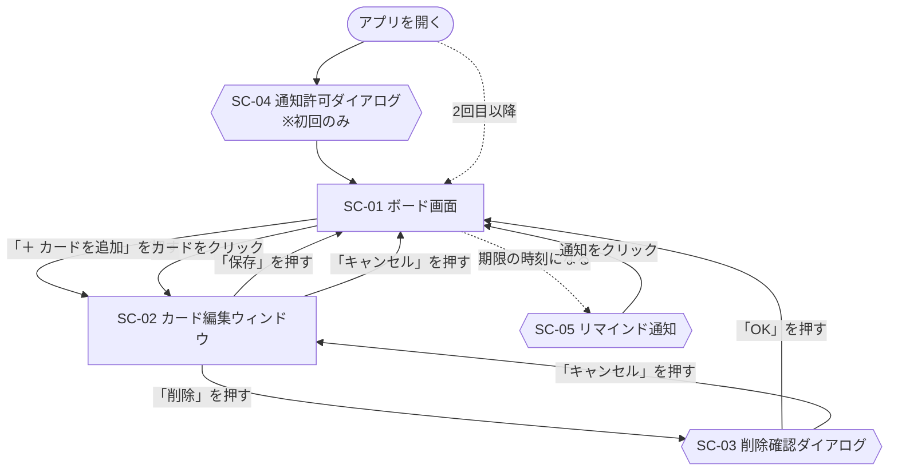
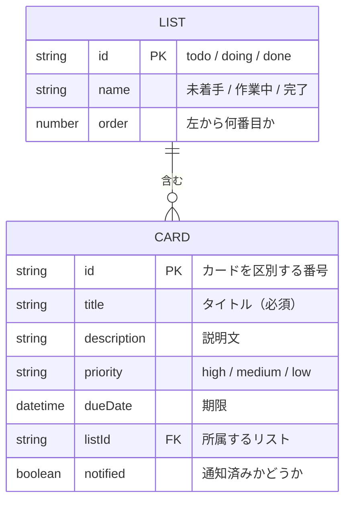
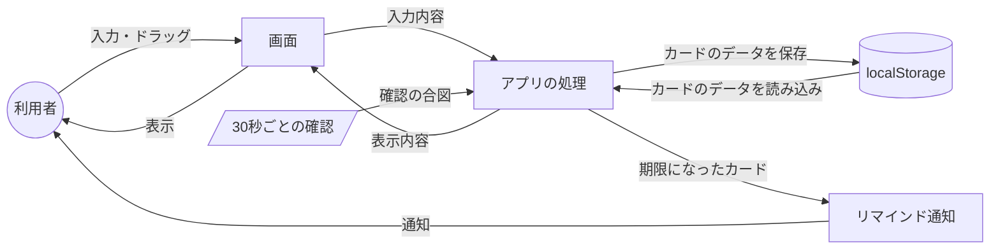

# Trello風タスク管理アプリ 設計書

作成日：2026年9月26日

[要件定義書](requirements.md) で決めた機能を、どのように作るかをまとめる。

## 1. 画面一覧

| 画面ID | 画面名 | 種類 | 概要 |
|---|---|---|---|
| SC-01 | ボード画面 | メイン画面 | 3つのリストとカードを表示する。アプリを開くと最初に表示される |
| SC-02 | カード編集ウィンドウ | ウィンドウ | カードの追加と編集に使う。ボード画面の上に重ねて表示する |
| SC-03 | 削除確認ダイアログ | ダイアログ | カードを削除してよいか確認する |
| SC-04 | 通知許可ダイアログ | ブラウザ標準 | ブラウザ通知を許可するか確認する。初回のみ表示される |
| SC-05 | リマインド通知 | ブラウザ標準 | 期限の時刻になったカードを知らせる。パソコンの画面の端に表示される |

SC-04 と SC-05 はブラウザが用意する画面のため、見た目は作らない。

## 2. 画面遷移図



- カードの移動と並び替えは、ボード画面の中でドラッグして行うため、画面は切り替わらない
- リマインド通知をクリックすると、アプリのタブが前面に表示される

## 3. 画面レイアウト

### 3.1 SC-01 ボード画面

```
┌─────────────────────────────────────────────────┐
│  タスク管理                                      │ ← ①
├───────────────┬───────────────┬─────────────────┤
│ 未着手 (2)     │ 作業中 (1)     │ 完了 (1)         │ ← ②
│ ┌───────────┐ │ ┌───────────┐ │ ┌─────────────┐ │
│ │[高] 課題A  │ │ │[中] 資料作成│ │ │[低] 本を返す │ │ ← ③
│ │ 9/30 20:00 │ │ │ 10/1 18:00 │ │ │             │ │
│ └───────────┘ │ └───────────┘ │ └─────────────┘ │
│ ＋ カードを追加 │ ＋ カードを追加 │ ＋ カードを追加   │ ← ④
└───────────────┴───────────────┴─────────────────┘
```

| No. | 項目 | 内容 |
|---|---|---|
| ① | ヘッダー | アプリ名「タスク管理」を表示する |
| ② | リスト名 | 「未着手」「作業中」「完了」と、カードの枚数を表示する |
| ③ | カード | 優先度・タイトル・期限を表示する。クリックすると SC-02 を開く。ドラッグで移動と並び替えができる |
| ④ | 追加ボタン | 押すと SC-02 を開く。追加したカードは、そのリストの一番下に入る |

**カードの表示ルール**

| 状態 | 表示 |
|---|---|
| 優先度：高 | 赤色のラベル |
| 優先度：中 | 黄色のラベル |
| 優先度：低 | 灰色のラベル |
| 期限なし | 期限の欄を表示しない |
| 期限切れ（完了リスト以外） | カードの枠と期限の文字を赤色にする |

### 3.2 SC-02 カード編集ウィンドウ

```
┌──────────────────────────────┐
│ カードの追加 / カードの編集    │ ← ①
│ タイトル（必須） [__________] │ ← ②
│ 説明文         [__________]  │ ← ③
│                [__________]  │
│ 優先度         [ 中 ▼ ]      │ ← ④
│ 期限           [日付と時刻]   │ ← ⑤
│                              │
│ [削除]        [キャンセル][保存] │ ← ⑥
└──────────────────────────────┘
```

| No. | 項目 | 入力方法 | 必須 | 初期値 | 内容 |
|---|---|---|---|---|---|
| ① | 見出し | ― | ― | ― | 追加のときは「カードの追加」、編集のときは「カードの編集」 |
| ② | タイトル | 1行の入力欄 | 必須 | 空 | 1〜50文字。空白だけは不可。条件を満たさないまま保存すると、エラーメッセージを表示する |
| ③ | 説明文 | 複数行の入力欄 | 任意 | 空 | 500文字まで |
| ④ | 優先度 | 選択肢（高・中・低） | 必須 | 中 | |
| ⑤ | 期限 | 日付と時刻の入力欄 | 任意 | 空 | 過去の日時も設定できる |
| ⑥ | ボタン | ― | ― | ― | 「削除」は編集のときだけ表示する |

**エラーメッセージ**

| 条件 | メッセージ |
|---|---|
| タイトルが空、または空白だけ | タイトルを入力してください |
| タイトルが50文字を超えている | タイトルは50文字以内で入力してください |

メッセージはタイトルの入力欄の下に赤字で表示する。

### 3.3 SC-03 削除確認ダイアログ

「このカードを削除しますか？」と表示し、「OK」と「キャンセル」のボタンを置く。

## 4. ER図



- 1つのリストには、0枚以上のカードが入る
- 1枚のカードは、必ず1つのリストに入る
- リストは3つで固定のため、プログラムの中に直接書き、保存はしない

### 4.1 CARD の項目

| 項目 | 型 | 必須 | 内容 |
|---|---|---|---|
| id | 文字列 | 必須 | カードを区別する番号。作成した時刻から自動で作る |
| title | 文字列 | 必須 | タイトル |
| description | 文字列 | 任意 | 説明文。未入力は空の文字列 |
| priority | 文字列 | 必須 | `high`（高）/ `medium`（中）/ `low`（低） |
| dueDate | 日時 | 任意 | 期限。未入力は空の文字列 |
| listId | 文字列 | 必須 | 所属するリストの id |
| notified | 真偽値 | 必須 | 通知済みなら `true`。期限を変更したら `false` に戻す |

リスト内の表示順は、カードを保存している配列の順番で表す。

## 5. データフロー図



| 処理 | データの流れ |
|---|---|
| アプリを開く | localStorage → アプリの処理 → 画面に表示 |
| カードの追加・編集・削除・移動 | 画面での操作 → アプリの処理 → localStorage に保存 → 画面を再表示 |
| リマインド | 30秒ごとの確認 → アプリの処理が期限を判定 → 通知を表示 → 通知済みとして localStorage に保存 |

### 5.1 通知・期限切れの条件

| 判定 | 条件 |
|---|---|
| 通知する | 期限が設定されている、期限の時刻を過ぎている、完了リストにない、まだ通知していない |
| 期限切れ表示 | 期限が設定されている、期限の時刻を過ぎている、完了リストにない |

ブラウザは表示していないタブの処理を遅らせることがあるため、通知が最大1分程度遅れる場合がある。

## 6. 技術構成

| 項目 | 内容 |
|---|---|
| 画面 | HTML + CSS + JavaScript（フレームワークは使わない） |
| ドラッグ＆ドロップ | [SortableJS](https://sortablejs.github.io/Sortable/)（CDN から読み込む） |
| データの保存 | ブラウザの localStorage |
| 通知 | ブラウザの Notification API |
| 動作確認 | VSCode の拡張機能「Live Server」でローカルサーバーを起動して開く |

ブラウザ通知はファイルを直接開いた状態（`file://`）では動かない場合があるため、Live Server を使って `http://localhost` で開く。

### 6.1 ファイル構成

```
taskmanagement/
├── index.html   … 画面の骨組み
├── style.css    … 見た目
├── script.js    … 動き（追加・編集・削除・移動・保存・通知）
└── docs/
    ├── requirements.md
    └── design.md
```

## 7. 要件との対応

| No. | 機能 | 設計の該当箇所 |
|---|---|---|
| F-01 | ボード表示 | 3.1 |
| F-02 | カード追加 | 2、3.1、3.2 |
| F-03 | カード編集 | 2、3.2 |
| F-04 | カード削除 | 2、3.2、3.3 |
| F-05 | リスト間の移動 | 3.1 |
| F-06 | リスト内の並び替え | 3.1、4.1 |
| F-07 | データ保存 | 4、5 |
| F-08 | リマインド通知 | 2、5、5.1 |
| F-09 | 期限切れの表示 | 3.1、5.1 |
