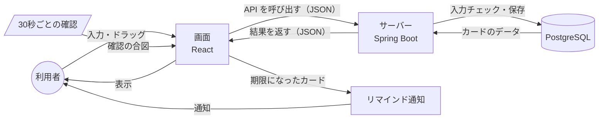

# データフロー

作成日：2026年10月5日
更新日：2026年10月6日（保存先を localStorage から バックエンド API ＋ PostgreSQL に変更）

利用者の操作やタイマーから、データがどのように流れるかをまとめる。保存するデータの項目は [データベース設計](database.md) にまとめる。

## 1. データフロー図

- 30秒ごとの確認、通知・期限切れ・優先度の判定は、画面（React）側で行う。画面に読み込んだカードのデータと、ブラウザの現在時刻を使う
- 通知を出したら、通知済みになったことを API でサーバーに伝える

## 2. 処理ごとのデータの流れ

| 処理 | データの流れ |
| --- | --- |
| アプリを開く | 画面 → カード一覧の API → PostgreSQL から読み込み → 画面に表示 |
| カードの追加・編集・削除・移動 | 画面での操作 → 該当する API → 入力チェック → PostgreSQL に保存 → 結果を画面に返す → 画面を再表示 |
| リマインド | 30秒ごとの確認 → 画面が期限を判定 → 通知を表示 → 通知済みの API → PostgreSQL に保存 |

入力チェックで誤りが見つかったときは、保存せずにエラーの内容を画面に返す。

## 3. API 一覧

URL はすべて `/api` から始める。データは JSON でやり取りする。

| 処理 | メソッド | URL | 送る内容 | 返す内容 |
| --- | --- | --- | --- | --- |
| カード一覧の取得 | GET | `/api/cards` | なし | すべてのカード（リストと並び順つき） |
| カード 1 件の取得 | GET | `/api/cards/{id}` | なし | 指定したカード（存在しない id は 404） |
| カードの追加 | POST | `/api/cards` | タイトル、説明文、期限、時間厳守、追加先のリスト | 追加したカード |
| カードの編集 | PUT | `/api/cards/{id}` | タイトル、説明文、期限、時間厳守 | 編集後のカード |
| カードの削除 | DELETE | `/api/cards/{id}` | なし | なし |
| カードの移動・並び替え | PATCH | `/api/cards/{id}/move` | 移した先のリスト、並び順 | 移動後のカード一覧 |
| 通知済みにする | PATCH | `/api/cards/{id}/notified` | なし | 更新後のカード |

- 追加したカードは、指定したリストの一番下に入る。リストを省略したときは「未着手」に入る
- 入力に誤りがあるときは 400 を返し、項目ごとのエラーメッセージを `{"message": "入力内容に誤りがあります", "errors": {"title": "タイトルを入力してください"}}` の形で返す
- 編集で期限を変えたときは、サーバー側で通知済みを `false` に戻す
- チェックボックスでの移動（F-11）も、カードの移動・並び替えの API を使う

## 4. 通知・期限切れの判定

| 判定 | 条件 |
| --- | --- |
| 通知する | 期限が設定されている、期限の時刻を過ぎている、完了リストにない、まだ通知していない |
| 期限切れ表示 | 期限が設定されている、期限の時刻を過ぎている、完了リストにない |

優先度は、次の順に決める。表示のたびと30秒ごとの確認のたびに決め直すため、期限が近づくと自動で上がる。

1. 期限の日付で決める（時刻は見ない）

| 期限 | 優先度 |
| --- | --- |
| 今日、または過ぎている | 高 |
| 明日から7日後まで | 中 |
| 8日後以降、または期限なし | 低 |

2. 時間厳守なら1段階上げる（低→中、中→高）。高はそのまま

ブラウザは表示していないタブの処理を遅らせることがあるため、通知が最大1分程度遅れる場合がある。
