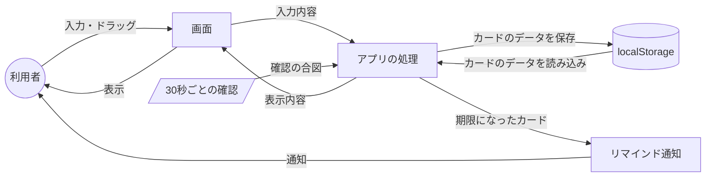

# データフロー

作成日：2026年10月5日

利用者の操作やタイマーから、データがどのように流れるかをまとめる。保存するデータの項目は [データベース設計](database.md) にまとめる。

## 1. データフロー図

## 2. 処理ごとのデータの流れ

| 処理 | データの流れ |
| --- | --- |
| アプリを開く | localStorage → アプリの処理 → 画面に表示 |
| カードの追加・編集・削除・移動 | 画面での操作 → アプリの処理 → localStorage に保存 → 画面を再表示 |
| リマインド | 30秒ごとの確認 → アプリの処理が期限を判定 → 通知を表示 → 通知済みとして localStorage に保存 |

## 3. 通知・期限切れの判定

| 判定 | 条件 |
| --- | --- |
| 通知する | 期限が設定されている、期限の時刻を過ぎている、完了リストにない、まだ通知していない |
| 期限切れ表示 | 期限が設定されている、期限の時刻を過ぎている、完了リストにない |

ブラウザは表示していないタブの処理を遅らせることがあるため、通知が最大1分程度遅れる場合がある。
