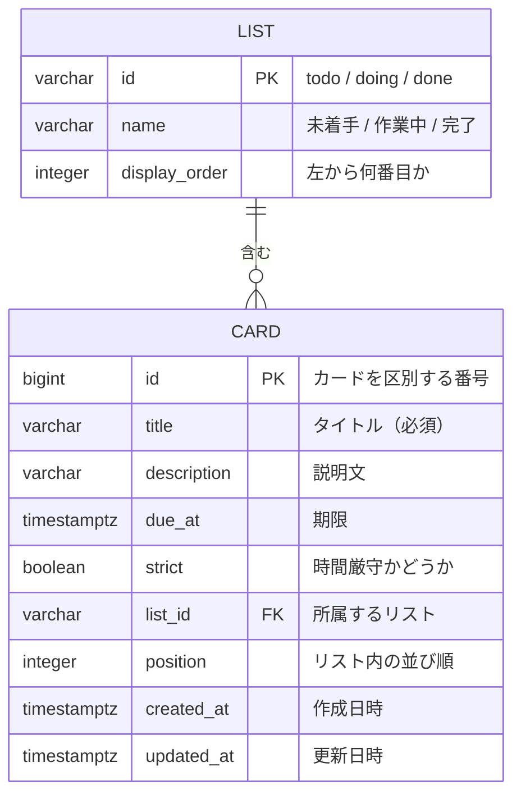

# データベース設計

作成日：2026年10月5日
更新日：2026年10月6日（保存先を localStorage から PostgreSQL に変更）
更新日：2026年10月10日（リマインド通知をやめたため、notified 列を削除）

アプリで扱うデータの項目と、PostgreSQL のテーブル定義をまとめる。

## 1. データ項目

カードは次の項目を持つ。リストは3つ固定のため、利用者が変更できる項目はない。

| 項目 | 必須 | 内容 |
| --- | --- | --- |
| タイトル | 必須 | タスクの名前 |
| 説明文 | 任意 | タスクの詳しい内容やメモ |
| 期限 | 任意 | 日付と時刻。期限切れと優先度の判定にも使う |
| 時間厳守 | 任意 | 遅れてはいけないタスクかどうか。優先度の判定に使う |
| 所属リスト | 自動 | 未着手・作業中・完了 のどれか |
| 表示順 | 自動 | リスト内の並び順 |

入力のルール（文字数など）は [機能要件](../requirements/functional.md) にまとめる。

## 2. ER図

- 1つのリストには、0枚以上のカードが入る
- 1枚のカードは、必ず1つのリストに入る
- リストは3つで固定。Flyway の最初のテーブル作成 SQL で登録し、アプリから追加・変更・削除はしない

## 3. テーブル定義

テーブル名・列名は小文字のスネークケース（`due_at` など）で書く。Java のクラスでは `dueAt` のようにキャメルケースにする。

### 3.1 list（リスト）

| 列名 | 型 | NULL | 内容 |
| --- | --- | --- | --- |
| id | VARCHAR(10) | 不可 | 主キー |
| name | VARCHAR(10) | 不可 | リストの名前 |
| display_order | INTEGER | 不可 | 左から何番目か |

登録するデータ：

| id | name | display_order |
| --- | --- | --- |
| `todo` | 未着手 | 1 |
| `doing` | 作業中 | 2 |
| `done` | 完了 | 3 |

### 3.2 card（カード）

| 列名 | 型 | NULL | 初期値 | 内容 |
| --- | --- | --- | --- | --- |
| id | BIGINT | 不可 | 自動で連番 | 主キー（`GENERATED ALWAYS AS IDENTITY`） |
| title | VARCHAR(50) | 不可 | ― | タイトル。1〜50文字 |
| description | VARCHAR(500) | 不可 | `''` | 説明文。未入力は空の文字列 |
| due_at | TIMESTAMPTZ | 可 | NULL | 期限。未入力は NULL |
| strict | BOOLEAN | 不可 | `false` | 時間厳守なら `true` |
| list_id | VARCHAR(10) | 不可 | `'todo'` | 所属するリストの id（外部キー → list.id） |
| position | INTEGER | 不可 | ― | リスト内の並び順。0 から始まり、上から順に 0, 1, 2 … |
| created_at | TIMESTAMPTZ | 不可 | 現在日時 | 作成した日時 |
| updated_at | TIMESTAMPTZ | 不可 | 現在日時 | 最後に変更した日時 |

- タイトルが空や空白だけでないかは、バックエンドの入力チェック（Bean Validation）で確かめる
- 期限は日本時間で入力するが、タイムゾーン付きの型（TIMESTAMPTZ）で保存する
- カードを別のリストへ移したり並び替えたりしたときは、移す前と移した先のリストの `position` を振り直す。1つのトランザクションでまとめて更新し、途中で失敗したら元に戻す

優先度は保存しない。時間が経つと変わるため、表示のたびに期限と時間厳守から決める（[データフロー](data-flow.md) の「4. 期限切れ・優先度の判定」）。

## 4. 保存方法

- 保存先は PostgreSQL
- 画面からは直接データベースに触らず、必ずバックエンドの API を通して読み書きする（API の一覧は [データフロー](data-flow.md) の「3. API 一覧」）
- テーブルの作成・変更は Flyway の SQL ファイル（`backend/src/main/resources/db/migration/`）で管理する。データベースを直接書き換えて変更しない
