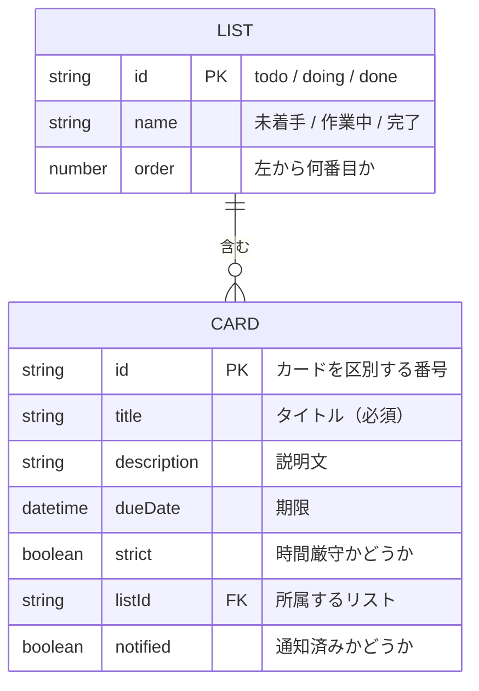

# データベース設計

作成日：2026年10月5日

アプリで扱うデータの項目と、localStorage への保存方法をまとめる。

## 1. データ項目

カードは次の項目を持つ。リストは3つ固定のため、利用者が変更できる項目はない。

| 項目 | 必須 | 内容 |
| --- | --- | --- |
| タイトル | 必須 | タスクの名前 |
| 説明文 | 任意 | タスクの詳しい内容やメモ |
| 期限 | 任意 | 日付と時刻。リマインド通知と優先度の判定にも使う |
| 時間厳守 | 任意 | 遅れてはいけないタスクかどうか。優先度の判定に使う |
| 所属リスト | 自動 | 未着手・作業中・完了 のどれか |
| 表示順 | 自動 | リスト内の並び順 |

入力のルール（文字数など）は [機能要件](../requirements/functional.md) にまとめる。

## 2. ER図

- 1つのリストには、0枚以上のカードが入る
- 1枚のカードは、必ず1つのリストに入る
- リストは3つで固定のため、プログラムの中に直接書き、保存はしない

## 3. テーブル定義

### 3.1 LIST（リスト）

プログラムの中に直接書く。保存はしない。

| id | name | order |
| --- | --- | --- |
| `todo` | 未着手 | 1 |
| `doing` | 作業中 | 2 |
| `done` | 完了 | 3 |

### 3.2 CARD（カード）

| 項目 | 型 | 必須 | 内容 |
| --- | --- | --- | --- |
| id | 文字列 | 必須 | カードを区別する番号。作成した時刻から自動で作る |
| title | 文字列 | 必須 | タイトル |
| description | 文字列 | 任意 | 説明文。未入力は空の文字列 |
| dueDate | 日時 | 任意 | 期限。未入力は空の文字列 |
| strict | 真偽値 | 必須 | 時間厳守なら `true`。初期値は `false` |
| listId | 文字列 | 必須 | 所属するリストの id |
| notified | 真偽値 | 必須 | 通知済みなら `true`。期限を変更したら `false` に戻す |

リスト内の表示順は、カードを保存している配列の順番で表す。

優先度は保存しない。時間が経つと変わるため、表示のたびに期限と時間厳守から決める（[データフロー](data-flow.md) の「3. 通知・期限切れの判定」）。

## 4. 保存方法

- 保存先はブラウザの localStorage
- カードの配列を JSON の文字列にして、1つのキーにまとめて保存する
- 変更のたびに、配列全体を上書きして保存する
