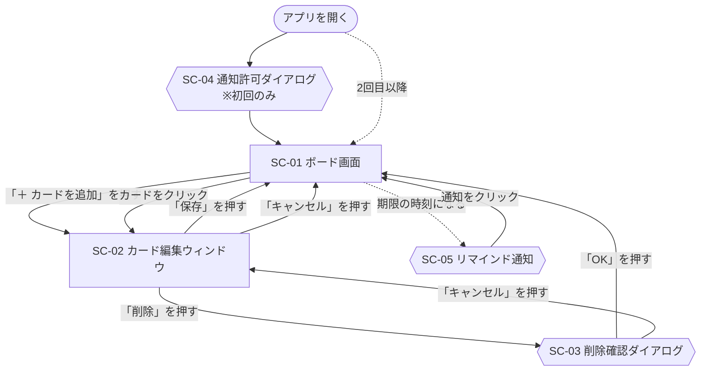

# 画面設計

作成日：2026年10月5日

[画面要件](../requirements/screens.md) で決めた画面を、どのように配置し、どう移り変わるかをまとめる。表示する情報や表示ルールは画面要件を参照する。

## 1. 画面遷移図



- カードの移動と並び替えは、ボード画面の中でドラッグして行うため、画面は切り替わらない
- リマインド通知をクリックすると、アプリのタブが前面に表示される

## 2. 画面レイアウト

### 2.1 SC-01 ボード画面

```text
┌─────────────────────────────────────────────────┐
│  タスク管理                                      │ ← ①
├───────────────┬───────────────┬─────────────────┤
│ 未着手 (2)     │ 作業中 (1)     │ 完了 (1)         │ ← ②
│ ┌───────────┐ │ ┌───────────┐ │ ┌─────────────┐ │
│ │[高] 課題A  │ │ │[中] 資料作成│ │ │[低] 本を返す │ │ ← ③
│ │ 9/30 20:00 │ │ │ 10/1 18:00 │ │ │             │ │
│ └───────────┘ │ └───────────┘ │ └─────────────┘ │
│ ＋ カードを追加 │ ＋ カードを追加 │ ＋ カードを追加   │ ← ④
└───────────────┴───────────────┴─────────────────┘
```

| No. | 項目 | 配置 |
| --- | --- | --- |
| ① | ヘッダー | 画面の一番上に、横幅いっぱいに置く |
| ② | リスト名 | 各リストの一番上に置く。リスト名のあとに（ ）でカードの枚数を付ける |
| ③ | カード | リスト名の下に縦に並べる。1行目に優先度ラベルとタイトル、2行目に期限を置く |
| ④ | 追加ボタン | 各リストのカードの一番下に置く |

3つのリストは横に並べる。カードの色分けは [画面要件](../requirements/screens.md) の「カードの表示ルール」に従う。

### 2.2 SC-02 カード編集ウィンドウ

```text
┌──────────────────────────────┐
│ カードの追加 / カードの編集    │ ← ①
│ タイトル（必須） [__________] │ ← ②
│ 説明文         [__________]  │ ← ③
│                [__________]  │
│ 優先度         [ 中 ▼ ]      │ ← ④
│ 期限           [日付と時刻]   │ ← ⑤
│                              │
│ [削除]        [キャンセル][保存] │ ← ⑥
└──────────────────────────────┘
```

| No. | 項目 | 配置 |
| --- | --- | --- |
| ① | 見出し | ウィンドウの一番上に置く |
| ② | タイトル | 項目名を左、入力欄を右に置く。エラーメッセージは入力欄のすぐ下に置く |
| ③ | 説明文 | 複数行の入力欄にする |
| ④ | 優先度 | 選択肢から選ぶ形にする |
| ⑤ | 期限 | 日付と時刻をまとめて入力できる欄にする |
| ⑥ | ボタン | 「削除」を左端、「キャンセル」「保存」を右端に置く |

ウィンドウはボード画面の上に重ねて表示する。入力項目とエラーの扱いは [画面要件](../requirements/screens.md) の SC-02 に従う。

### 2.3 SC-03 削除確認ダイアログ

「このカードを削除しますか？」の文と、「OK」「キャンセル」のボタンだけを置く。ブラウザ標準のものにするか、アプリの見た目に合わせて作るかは未決（[要件定義書](../requirements.md) の「8. 未決事項」）。
