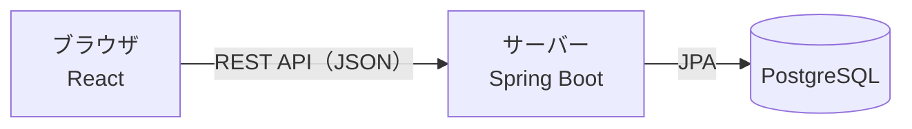

# 技術スタック

作成日：2026年10月5日
更新日：2026年10月6日（バックエンドを Java + Spring Boot、フロントエンドを React、データベースを PostgreSQL に変更）

アプリを作るのに使う技術と、ファイルの構成をまとめる。

## 1. 全体の構成

画面（React）とサーバー（Spring Boot）を分け、データは PostgreSQL に保存する。画面とサーバーは REST API（JSON）でやり取りする。



Next.js は今回使わない。React は Vite で作る、ブラウザだけで動く画面（SPA）とする。

## 2. 使う技術

### 2.1 バックエンド

| 項目 | 内容 |
| --- | --- |
| 言語 | Java 21（LTS） |
| フレームワーク | Spring Boot 4 系 |
| ビルドツール | Maven |
| API | Spring Web（REST API） |
| データベース操作 | Spring Data JPA（Hibernate） |
| 入力チェック | Bean Validation（Hibernate Validator） |
| テーブル作成・変更の管理 | Flyway |
| テスト | JUnit 5、Mockito、Spring Boot Test、Testcontainers（テスト用の PostgreSQL を起動する） |

### 2.2 フロントエンド

| 項目 | 内容 |
| --- | --- |
| 言語 | TypeScript |
| ライブラリ | React 19 |
| ビルドツール・開発サーバー | Vite |
| ドラッグ＆ドロップ | [dnd-kit](https://dndkit.com/) |
| サーバーとの通信 | ブラウザ標準の fetch |
| 通知 | ブラウザの Notification API |
| テスト | Vitest、React Testing Library |
| コードの整形・チェック | ESLint、Prettier |

### 2.3 データベース

| 項目 | 内容 |
| --- | --- |
| データベース | PostgreSQL 17 |
| 起動方法（開発時） | Docker Compose でコンテナとして起動する |
| サービス名・データベース名・ユーザー名 | サービス名 `db`、データベース名 `taskapp`、ユーザー名 `taskapp`（開発用。パスワードは `docker-compose.yml` と `application.yml` に書く） |
| ポート | `5432` |

### 2.4 開発環境

| 項目 | 内容 |
| --- | --- |
| エディタ | VSCode（Java と React の拡張機能を入れる） |
| 動作確認 | バックエンドを `http://localhost:8080`、フロントエンドを Vite の開発サーバー `http://localhost:5173` で起動して開く |
| API の呼び出し先 | Vite のプロキシ設定で `/api` をバックエンドに転送する（CORS の設定を不要にするため） |

ブラウザ通知は `http://localhost` で開いた状態なら動く。

対応ブラウザなどの動作環境は [非機能要件](../requirements/non-functional.md) にまとめる。

## 3. ファイル構成

```text
taskmanagement/
├── docker-compose.yml           … PostgreSQL の起動設定
├── backend/                     … Spring Boot のプロジェクト
│   ├── pom.xml
│   └── src/
│       ├── main/
│       │   ├── java/…/
│       │   │   ├── controller/  … API の入口
│       │   │   ├── service/     … 処理のまとまり（優先度の判定など）
│       │   │   ├── repository/  … データベースの読み書き
│       │   │   └── entity/      … テーブルに対応するクラス
│       │   └── resources/
│       │       ├── application.yml
│       │       └── db/migration/ … Flyway のテーブル作成 SQL
│       └── test/
├── frontend/                    … React のプロジェクト
│   ├── package.json
│   ├── vite.config.ts
│   └── src/
│       ├── components/          … 画面の部品（リスト、カード、ダイアログ）
│       ├── api/                 … サーバーとの通信
│       └── App.tsx
├── prototype/                   … これまでの HTML + CSS + JavaScript のプロトタイプ
│   ├── index.html
│   ├── style.css
│   └── script.js
└── docs/
    ├── requirements.md          … 要件定義書（全体のまとめ）
    ├── requirements/
    │   ├── features.md          … 機能一覧
    │   ├── functional.md        … 機能要件
    │   ├── non-functional.md    … 非機能要件
    │   └── screens.md           … 画面要件
    ├── design/
    │   ├── screen-design.md     … 画面設計
    │   ├── database.md          … データベース設計
    │   ├── data-flow.md         … データフロー
    │   └── tech-stack.md        … 技術スタック
    └── test-spec.md             … テスト仕様書
```

`backend/`、`frontend/`、`prototype/` はこれから作る（今あるプロトタイプのファイルは `prototype/` に移す予定）。
