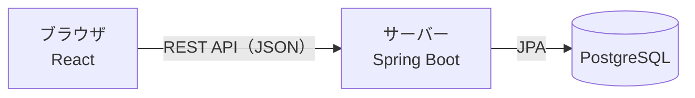

# 技術スタック

作成日：2026年10月5日
更新日：2026年10月6日（バックエンドを Java + Spring Boot、フロントエンドを React、データベースを PostgreSQL に変更）
更新日：2026年10月7日（フロントエンドのコードチェックを ESLint から oxlint に変更。`frontend/` を作成）
更新日：2026年10月10日（各技術のバージョンを追記。ファイル構成を今のリポジトリに合わせる）

アプリを作るのに使う技術と、ファイルの構成をまとめる。

## 1. 全体の構成

画面（React）とサーバー（Spring Boot）を分け、データは PostgreSQL に保存する。画面とサーバーは REST API（JSON）でやり取りする。



Next.js は今回使わない。React は Vite で作る、ブラウザだけで動く画面（SPA）とする。

## 2. 使う技術

バージョンは 2026年10月10日時点で実際に使っているもの。

- バックエンドのライブラリのバージョンは、Spring Boot（`spring-boot-starter-parent`）がまとめて決める。`pom.xml` に個別のバージョンは書かない
- フロントエンドのライブラリは `package.json` に `^` つきで範囲を書き、実際に入るバージョンは `package-lock.json` で固定する。表には `package-lock.json` のバージョンを書く
- バージョンを上げたときは、この表も合わせて更新する

### 2.1 バックエンド

| 項目 | 内容 | バージョン |
| --- | --- | --- |
| 言語 | Java（LTS） | 21 |
| JDK | OpenJDK（Homebrew で入れたもの） | 21.0.12 |
| フレームワーク | Spring Boot | 4.1.1 |
| ビルドツール | Maven（Gradle は使わない） | 3.9.16 |
| ビルドツールの起動 | Maven Wrapper（`./mvnw`。決まったバージョンの Maven を自動で取ってきて動かすため、Maven を別に入れる必要はない） | 3.3.4 |
| API | Spring Web MVC（REST API） | Spring Boot に含まれるもの |
| データベース操作 | Spring Data JPA（Hibernate） | Spring Data JPA 4.1.1、Hibernate 7.4.5 |
| 入力チェック | Bean Validation（Hibernate Validator） | 9.1.3 |
| テーブル作成・変更の管理 | Flyway | 12.4.0 |
| PostgreSQL への接続 | PostgreSQL JDBC Driver | 42.7.13 |
| テスト | JUnit、Mockito、Spring Boot Test、Testcontainers（テスト用の PostgreSQL を起動する） | JUnit 6.0.3、Mockito 5.23.0、Testcontainers 2.0.5 |

### 2.2 フロントエンド

| 項目 | 内容 | バージョン |
| --- | --- | --- |
| 実行環境 | Node.js | 24.21.0 |
| パッケージ管理 | npm（依存関係は `package-lock.json` で固定する） | 11.19.0 |
| 言語 | TypeScript | 7.0.2 |
| ライブラリ | React（React DOM も同じ） | 19.3.0 |
| ビルドツール・開発サーバー | Vite（React 用プラグイン `@vitejs/plugin-react`） | Vite 8.3.4、プラグイン 6.1.2 |
| ドラッグ＆ドロップ | [dnd-kit](https://dndkit.com/) | 未導入（カードの移動を作るときに入れる） |
| サーバーとの通信 | ブラウザ標準の fetch | ― |
| 通知 | ブラウザの Notification API | ― |
| テスト | Vitest、React Testing Library（jsdom 上で動かす） | Vitest 5.0.3、React Testing Library 16.3.3、jsdom 30.1.2 |
| コードのチェック | oxlint | 1.87.0 |
| コードの整形 | Prettier | 3.9.9 |

### 2.3 データベース

| 項目 | 内容 | バージョン |
| --- | --- | --- |
| データベース | PostgreSQL | 17.11 |
| Docker イメージ | `postgres:17`（17 系の最新を使う。イメージを取り直すと 17 系の中で上がることがある） | `postgres:17` |
| 起動方法（開発時） | Docker Compose でコンテナとして起動する | Docker Compose 5.6.0 |
| サービス名・データベース名・ユーザー名 | サービス名 `db`、データベース名 `taskapp`、ユーザー名 `taskapp`（開発用。パスワードは `docker-compose.yml` と `application.yml` に書く） | ― |
| ポート | `5432` | ― |

### 2.4 開発環境

| 項目 | 内容 | バージョン |
| --- | --- | --- |
| エディタ | VSCode（Java と React の拡張機能を入れる） | ― |
| Java | OpenJDK（バックエンドのビルド・起動） | 21.0.12 |
| Node.js・npm | フロントエンドの依存関係の追加・開発サーバーの起動 | Node.js 24.21.0、npm 11.19.0 |
| Docker | Colima（Docker Desktop は使わない） | 0.10.3 |
| | Docker | 29.8.2 |
| | Docker Compose | 5.6.0 |
| バージョン管理 | Git | 2.39.5 |
| GitHub の操作 | GitHub CLI（`gh`。イシュー・PR の作成） | 2.101.0 |
| 開発サーバーの起動 | `scripts/dev-start.sh`・`scripts/dev-stop.sh` で、PostgreSQL・バックエンド・フロントエンドをまとめて起動・停止する | ― |
| 動作確認 | バックエンドを `http://localhost:8080`、フロントエンドを Vite の開発サーバー `http://localhost:5173` で起動して開く | ― |
| API の呼び出し先 | Vite のプロキシ設定で `/api` をバックエンドに転送する（CORS の設定を不要にするため） | ― |

ブラウザ通知は `http://localhost` で開いた状態なら動く。

対応ブラウザなどの動作環境は [非機能要件](../requirements/non-functional.md) にまとめる。

## 3. ファイル構成

```text
taskmanagement/
├── README.md
├── CLAUDE.md                    … Claude Code が守る開発ルール
├── docker-compose.yml           … PostgreSQL の起動設定
├── index.html                   … HTML + CSS + JavaScript のプロトタイプ
├── style.css
├── script.js
├── scripts/                     … 開発サーバーの起動・停止スクリプト
│   ├── dev-start.sh
│   ├── dev-stop.sh
│   └── dev-common.sh
├── backend/                     … Spring Boot のプロジェクト
│   ├── pom.xml
│   ├── mvnw                     … Maven Wrapper
│   ├── seed/sample-cards.sql    … 動作確認用のサンプルデータ
│   └── src/
│       ├── main/
│       │   ├── java/com/example/taskapp/
│       │   │   ├── card/        … カードとリストの API（Controller・Service・Repository・Entity）
│       │   │   └── common/      … エラー時のレスポンスなど、機能をまたぐ処理
│       │   └── resources/
│       │       ├── application.yml
│       │       └── db/migration/ … Flyway のテーブル作成 SQL
│       └── test/                … API のテスト（Testcontainers で PostgreSQL を起動する）
├── frontend/                    … React のプロジェクト
│   ├── package.json
│   ├── vite.config.ts           … 開発サーバー（5173）と /api の転送、Vitest の設定
│   └── src/
│       ├── api/                 … サーバーとの通信
│       ├── components/          … 画面の部品（ボード、リスト、カード）
│       ├── domain/              … 画面に依存しない処理（優先度・期限切れの判定など）
│       ├── test/                … テスト用のデータ
│       └── App.tsx
├── .claude/                     … Claude Code の設定（フック・スキル）
├── .github/                     … イシュー・PR のテンプレート
└── docs/
    ├── requirements.md          … 要件定義書（全体のまとめ）
    ├── requirements/
    │   ├── features.md          … 機能一覧
    │   ├── functional.md        … 機能要件
    │   ├── non-functional.md    … 非機能要件
    │   └── screens.md           … 画面要件
    ├── design/
    │   ├── screen-design.md     … 画面設計
    │   ├── database.md          … データベース設計
    │   ├── data-flow.md         … データフロー
    │   └── tech-stack.md        … 技術スタック
    └── test-spec.md             … テスト仕様書
```

バックエンドは、層（controller・service など）ごとではなく機能（`card` など）ごとにパッケージを分ける。プロトタイプ（`index.html`・`style.css`・`script.js`）は今はリポジトリの直下にあり、`prototype/` に移す予定。
